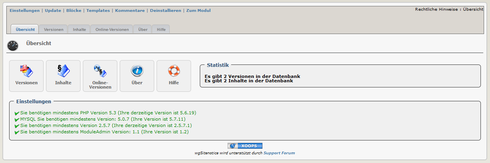

### _XOOPS Documentation Series_

# Module wgSitenotice
#### Version: 1.27 RC1
#### für XOOPS 2.5.7+
#### für PHP 5.5, 5.6 und 7.0
      

            
## Bedienungsanleitung

© 2014 The XOOPS Project (www.xoops.org)    

## Basisinformation zum Modul

wgSitenotice ist ein XOOPS-Modul für die Verwaltung der für Ihre Seite erforderlichen rechtlichen Hinweise.

 
*Figure 1: Hauptübersicht des Moduls wgSitenotice (Admin-Bereich)*

# Inhaltsverzeichnis

* [(De-)Installation](book/1install.md)
* [Administrationsbereich](book/2administration.md)
* [Einstellungen](book/3preferences.md)
* [Benutzerbereich](book/5userside.md)
* [Blöcke](book/6blocks.md)
* [Templates](book/7templates.md)
* [Modul Credits](book/9credits.md)

## Lizenzbestimmungen:

 Sofern nicht anders angegeben, fällt dieser Inhalt unter die Lizenzbestimmungen <a rel="license" href="http://creativecommons.org/licenses/by-nc-sa/4.0/">Creative Commons Attribution-NonCommercial-ShareAlike 4.0 International License</a>.

Alle Derivate sind Teil von XOOPS Project <a rel="xoops" href="http://www.xoops.org">www.xoops.org</a>

##Bedienungsanleitung Version: 1.1