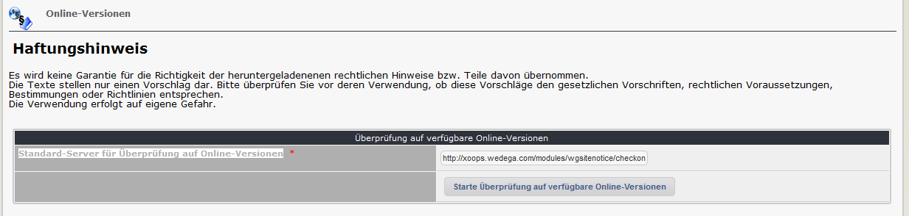
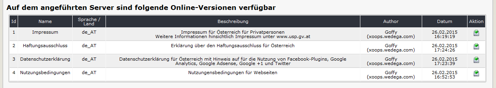

# 2.3 Online-Versionen

Auf dem Registerblatt 'Online-Versionen' können Sie von anderen Xoopsusern zur Verfügung gestellte Versionen herunterladen, sofern dieser auf seine Webseite wgSitenotice verwendet, den Download grundsätzlich erlaubt (siehe [Einstellungen](3preferences.md)) und für einzelne Versionen der Download tatsächlich freigegeben ist (siehe Registerblatt [Versionen](2admin_versions.md)).

##Achtung:
Jeder Autor stellt die Inhalte freiwillig und unentgeltlich zur Verfügung. Es wird keine Garantie für die Richtigkeit der heruntergeladenenen rechtlichen Hinweise bzw. Teile davon übernommen. Die Texte stellen nur einen Vorschlag dar. Bitte überprüfen Sie vor deren Verwendung, ob diese Vorschläge den gesetzlichen Vorschriften, rechtlichen Voraussetzungen, Bestimmungen oder Richtlinien entsprechen.
Die Verwendung erfolgt immer auf eigene Gefahr.
 
#### 2.3.1 Suchen nach verfügbaren Versionen

Mit "Starte Überprüfung auf verfügbare Online-Versionen" wird eine Anfrage an die jeweilige Webseite gesendet und eine Liste der verfügbaren Downloads zurückgemeldet. Sie können dafür auch jede Ihnen bekannte Webseite verwenden.

Bei einer erfolgreichen Anfrage wird eine Liste der verfügbaren Downloads angezeigt

Durch einen Klick auf  werden die entsprechenden Versionen mit den dazugehörigen Inhalten heruntergeladen.
