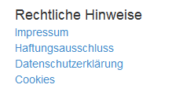
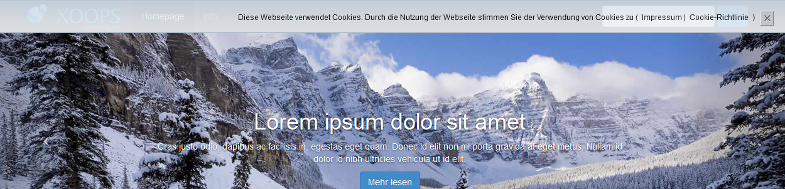
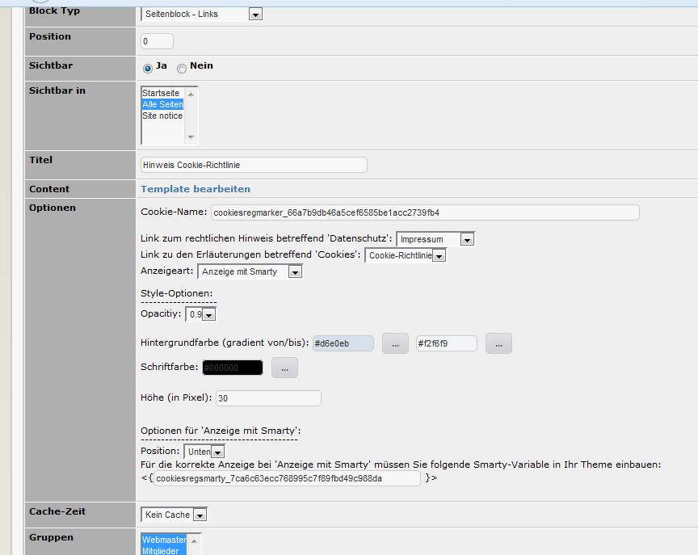
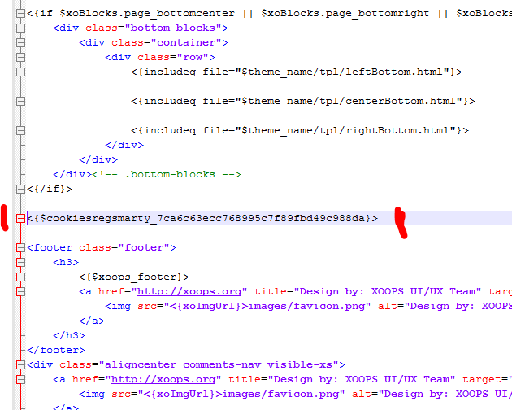

# 6. Blöcke

wgSitenotice bietet folgende Blöcke an:

## 6.1 Block mit einer Liste von Links auf die rechtlichen Hinweise

Beispiel:

## 6.2 Block Cookie-Richtlinie

Der Hinweis auf die Cookie-Richtline wird je nach Einstellung statisch oben oder unten auf der Webseite oder als einzelner Block angezeigt.

Beispiel Ansicht Hinweis auf Webseite Statisch oben:

In den Blockeinstellungen können z.B. die Hintergrundfarbe, Schriftfarbe usw. geändert werden.  
Es wird außerdem empfohlen, einen Link auf die Datenschutzbestimmungen sowie zu den Erläuterungen für Cookies zu setzen

Beispiel Ansicht Blockeinstellungen:

Wenn Sie den Hinweis mittels Smarty oben/unten auf Ihrer Webseite anzeigen wollten, müssen Sie irgendwo in Ihrem Theme eine Smarty-Variable mit dem entsprechenden Wert aus Ihren Blockeinstellungen platzieren.  
Dies sollte dann wie im nachfolgenden Beispiel aussehen:

  **  Achtung**: Wenn sie verschiedene Einstellungen testen, kann es erforderlich sein, dass Sie zwischendurch immer den Browsercache/-verlauf leeren müssen, damit das generierte Cookie auch gelöscht wird.

