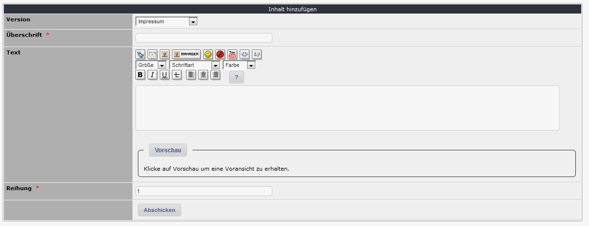

# Inhalte

Auf dem Registerblatt 'Inhalte' erhalten sie eine Auflistung die Detail zu Ihrem aktuellen Versionen. Jeder rechtlicher Hinweis kann aus einer oder mehreren Komponenten bestehen.

## 2.2.1 Auflistung der vorhandenen Inhalte

## 2.2.1 Inhalte bearbeiten/hinzufügen

## Version

Bitte definieren Sie, für welche Version dieser Inhalt verwendet werden soll.

## Überschrift

Sie können hier eine Überschrift für diesen Textbaustein wählen. Diese Information wird auf der Userseite als Überschrift angezeigt.

## Text

Bitte verfassen Sie hier den Detailtext für ihren rechtlichen Hinweis.

## Reihung

Eine Reihung ist nur bei Verwendung von mehreren Textbausteinen für ein und die selbe Version erforderlich.

