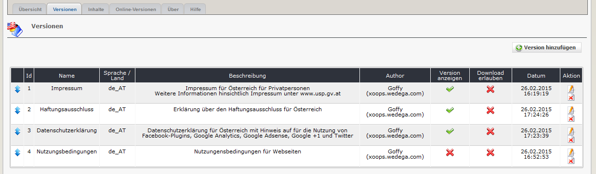

# Versionen

Auf dem Registerblatt 'Versionen' erhalten sie eine Auflistung der in ihrem aktuellen Rechtlichen Hinweise \(=Versionen\).

## 2.2.1 Auflistung der vorhandenen Versionen

Die Reihenfolge, in der die rechtlichen Inhalte auf der Userseite angezeigt werden, können per Drag&Drop geändert werden.

## 2.2.1 Versionen bearbeiten/hinzufügen

## Name

Bitte definieren Sie einen Namen für Ihren rechtlichen Hinweis. Dieser Name wird auf der Userseite angezeigt.

## Sprache / Land

Sie können hier die verwendete Sprache vermerken \(z.B. en\_EN, de\_AT,...\). Diese Information wird auf der Userseite nicht angezeigt.

## Beschreibung

Sie können hier zusätzliche Hinweise für die einzelnen Einträge vermerken. Diese Information wird auf der Userseite nicht angezeigt.

## Autor

Sie können hier den Autor des Eintrages vermerken. Diese Information wird auf der Userseite nicht angezeigt.

## Version anzeigen

Bitte definieren Sie, ob diese Version auf der Userseite angezeigt werden soll. Sie können jedoch auch Versionen in Ihrer Anwendung nur Speichern und dann anderen Administratoren zum Download anbieten.

## Download erlauben

Bitte definieren Sie, ob diese Version anderen Administratoren zum Download angeboten werden soll. Die entsprechende Webseite muss ebenfalls wgSitenotice installiert haben.

