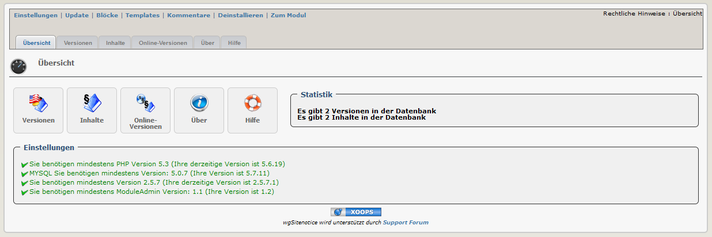

# Einleitung

## Module wgSitenotice

#### Version: 1.27 RC1

#### für XOOPS 2.5.7+

#### für PHP 5.5, 5.6 und 7.0

### Bedienungsanleitung

© 2014 The XOOPS Project \(www.xoops.org\)

### Basisinformation zum Modul

wgSitenotice ist ein XOOPS-Modul für die Verwaltung der für Ihre Seite erforderlichen rechtlichen Hinweise.

  
 _Figure 1: Hauptübersicht des Moduls wgSitenotice \(Admin-Bereich\)_

## Inhaltsverzeichnis

* [\(De-\)Installation](de-installation.md)
* [Administrationsbereich](administrationsbereich/)
* [Einstellungen](einstellungen.md)
* [Benutzerbereich](benutzerbereich.md)
* [Blöcke](bloecke.md)
* [Templates](templates.md)
* [Modul Credits](modul-credits.md)

### Lizenzbestimmungen:

  
Sofern nicht anders angegeben, fällt dieser Inhalt unter die Lizenzbestimmungen [Creative Commons Attribution-NonCommercial-ShareAlike 4.0 International License](http://creativecommons.org/licenses/by-nc-sa/4.0/).

Alle Derivate sind Teil von XOOPS Project [www.xoops.org](http://www.xoops.org)

### Bedienungsanleitung Version: 1.1

