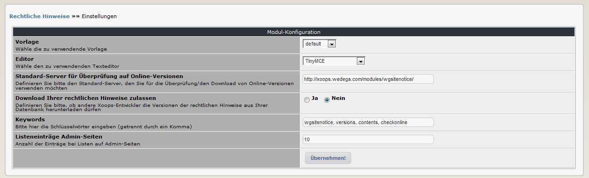

# Einstellungen

In den Moduleinstellungen können Sie verschiedene Optionen festlegen:  

## 3.1 Optionen im Detail

### Vorlage

Bitte hier die gewünschten Vorlage für die Anzeige Ihre rechtlichen Hinweise aus der Benutzerseite wählen. Dabei sind folgende Vorlagen standardmäßig vorhanden: default \(Standardformatierung Absätze\) table-style \(Anzeige im Standardtabellenformat\) block-style \(Anzeige wie die Standardblöcke\) xbootstrap \(Anzeige mit xbootstrap - xbootstrag muss vorhanden sein\)

### Editor

Bitte wählen Sie den zu verwendenden Texteditor für die Bearbeitung der Texte Xoops bietet standardmäßig 3 Editoren an:

#### 1\) nur Text

Dieser Editor dient zum Abspeichern von reinem Text

#### 2\) DHTML mit xCode

Ein Editor mit verschiedenen Xoops-Tags

#### 3\) TinyMCE

Umfangreicher Texteditor mit zahlreichen Optionen für Formatierungen, Listen, usw. Der Text wird in der Datenbank als HTML-Code abgespeichert.

Achtung: wenn Sie einen Text, der mit TinyMCE erstellt wurde, später mit z.B. DHTML-Editor anzeigen, so erscheinen natürlich alle Html-Tags. Verwenden Sie in diesem Fall wieder den TinyMCE oder entfernen Sie alle HTML-Tags.

### Standard-Server für Überprüfung auf Online-Versionen

Definieren Sie bitte den Standard-Server, den Sie für die Überprüfung/den Download von Online-Versionen verwenden möchten. Voreingestellt ist der Server des Modulentwicklers.

### Download Ihrer rechtlichen Hinweise zulassen

Definieren Sie bitte, ob grundsätzlich andere Xoops-Entwickler die Versionen der rechtlichen Hinweise aus Ihrer Datenbank herunterladen dürfen. Sie müssen jedoch noch zusätzlich je Version festlegen, ob diese downloadbar sein soll.

### Keywords

Bitte hier die Schlüsselwörter eingeben \(getrennt durch ein Komma\), die in den Metatags ihrer Seite verwendet werden sollen.

### Listeneinträge Admin-Seiten

Definieren sie die Anzahl der Einträge für die Listen im Administrationsbereich

