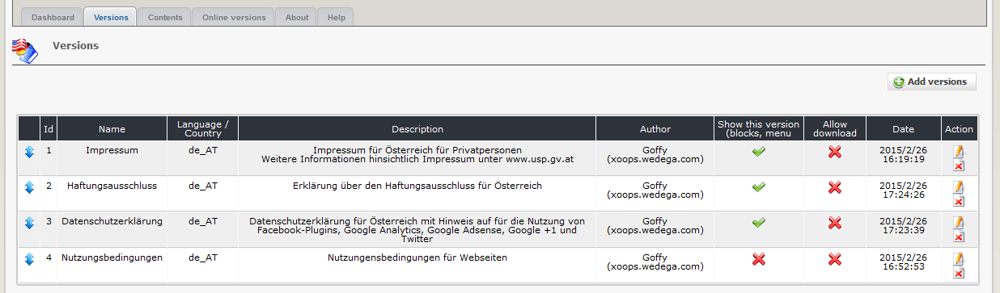
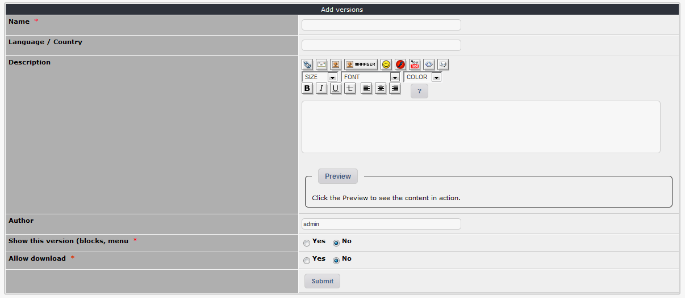

# 2.1 Versions

On the dashboard tab 'versions' you see a list of the existing versions.

#### 2.2.1 Auflistung der vorhandenen Versionen

If you use a list of several versions on user side, you can change ranking by drag & drop.

#### 2.2.1 Add/edit versions

#### Name
Please define a name for your legal notice. This name will be shown on userside.

#### Language / Country
Please define the used language (e.g. en_EN, de_AT,...). This information will be not shown on userside.

#### Description
You can write down additional information concerning your version. This information will be not shown on userside.

#### Author
You can make a note of the author of this item. This information will be not shown on userside.

#### Show this version
Please decide, whether this version should be shown on userside. You can also add versions to your website and provide it for other webdevelopers for download.

#### Allow download
Please decide, whether this version should be downloadable. The othe website must have installed also wgSitenotice.
