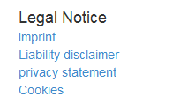
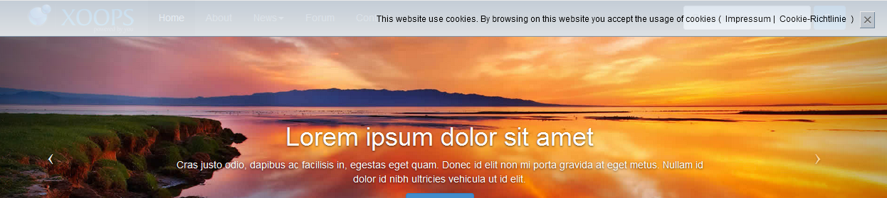
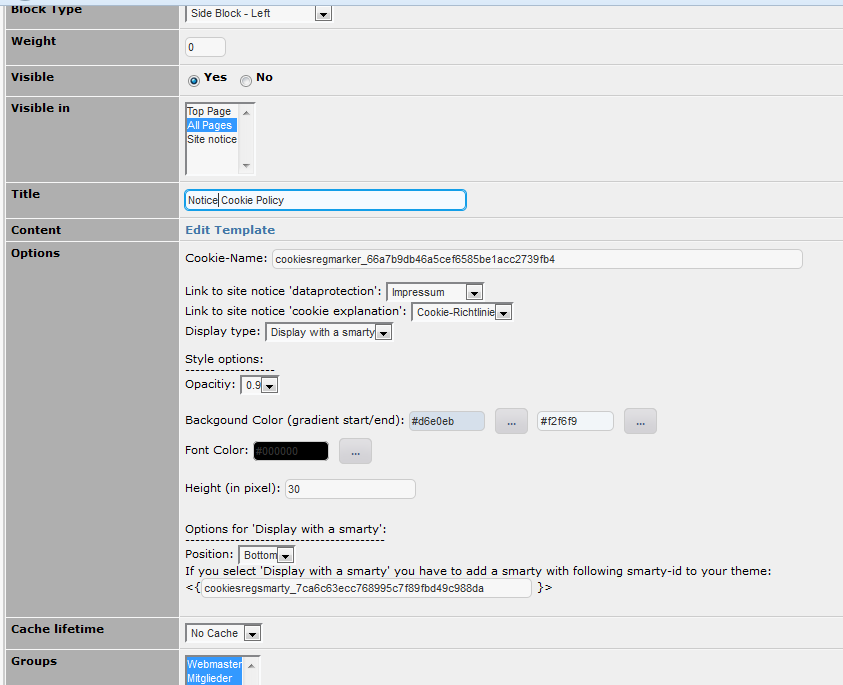
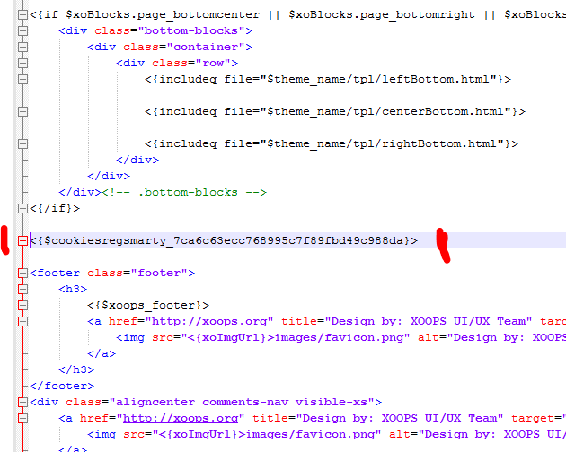

# Blocks

wgSitenotice offers following blocks:

## 6.1 Block with a link list for all legal notices

Example:

## 6.2 Block Cookie-Regulation

The notice concerning cookie policy will be, depending on your settings, static on top or on bottom of your website as as single block displayed.

Example Notice on website static top:

In the block settings you can additionally manage e.g. background color, font color, and so on. It is also recommended to set a link for data protection and explanation for cookies.

Example block settings:

If you want to show the notice on top/bottom, you should place a smarty variable with the corresponding value of the block settings somewhere in your theme. In this case it should look like this:

  **Attention**: If you are testing various settings, it can be necessary, that you clean the browser cache between the settings in order to delete the cookie created by wgsitenotice.

