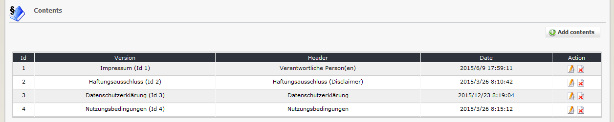

# Contents

On the dashboard tab 'contents' you see a list of the existing contents for your versions. Each version can have one or more components \(contents\)

## 2.2.1 List all existing contents

## 2.2.1 Add/edit contents

## Version

Please define the version, for which this content should be used.

## Header

You can define a header for each text component. This information will be shown on userside as heading.

## Text

Please define detailled text for your legal notice.

## Weight

Defining of weightings make sense, if you have more than one component for a several version.

