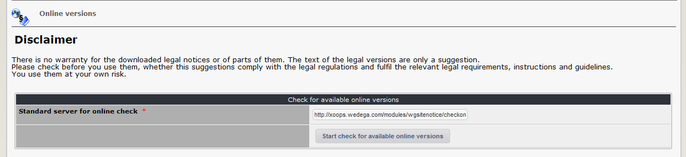
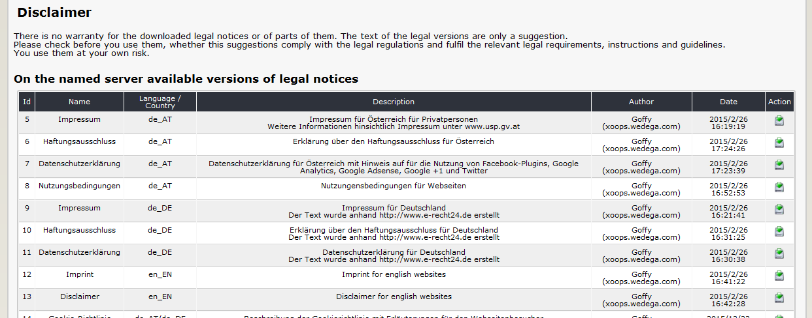

# Online-Versions

On the dashboard tab 'online versions' you can download online text components, which have been made available by other Xoops users, if the website of them use wgsitenotice, the download is basically enabled \(see [preferences](../preferences.md)\) and several versions are free for download \(see tab [versions](versions.md)\).

## Attention:

Each author provide text for free. There is no warranty for the downloaded legal notices or of parts of them. The text of the legal versions are only a suggestion. Please check before you use them, whether this suggestions comply with the legal regulations and fulfil the relevant legal requirements, instructions and guidelines. You use them at your own risk.

### 2.3.1 Searching for available versions

 By clicking on "Start check for available versions" an request will be sent to the defined website, which will return a list of available versions. You can send the request to each website you know, that they are using wgSitenotice.

If request is successful you see the list of available versions 

By clicking on  the versions with all related contents will be downloaded.

